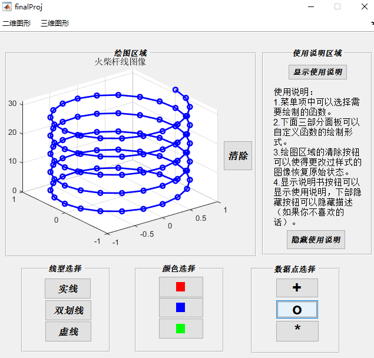

# MATLAB大作业

- 题目： MATLAB 图形绘制软件设计

- 建立一个图形界面来显示和处理二维、三维图形的颜色、线型以及数
  据点的图标，要求基本功能：
  （1） 建立一个主坐标系，用来显示要绘制的二维、三维图形；
  （2） 为图形界面加入两个菜单项，分别表示二维图形和三维图形，
  每一种图形不少于两种（具体函数自己决定）， 用子菜单控制；
  （3） 建立三个面板区域，一个用来选择线型，一个用来选择颜色，
  一个用来选择数据点的图标，每一个面板区域里面包含若干按
  钮，按钮上的文本分别表示线型、颜色或数据点图标样式。 单
  击不同的按钮则对应的图形的表示方式相应发生更改；  

- 最终效果：

  **初始UI**：
  
  

**二维图像选择：**

**三维图像选择：**

